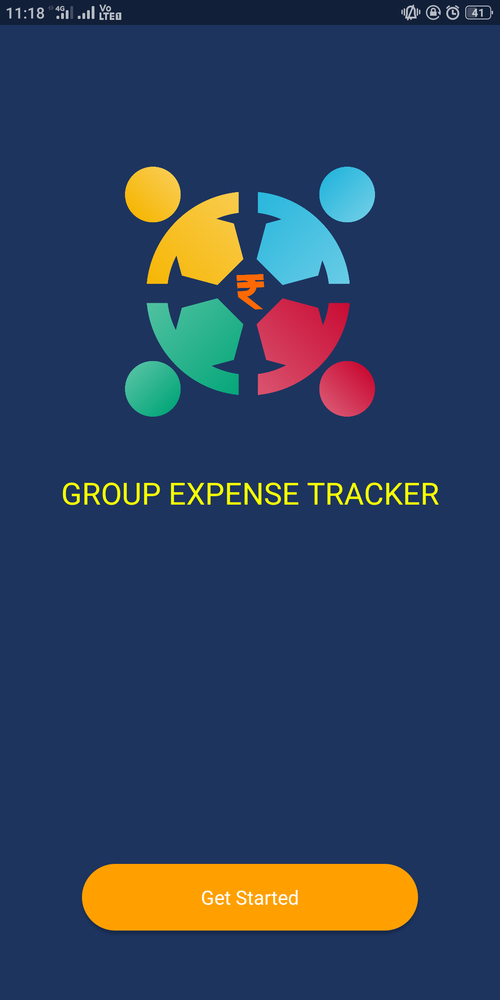
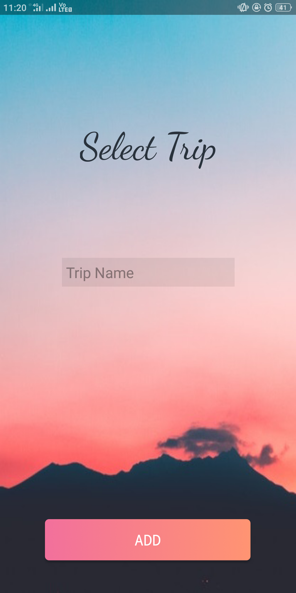
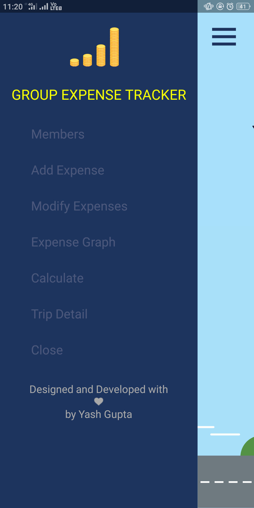
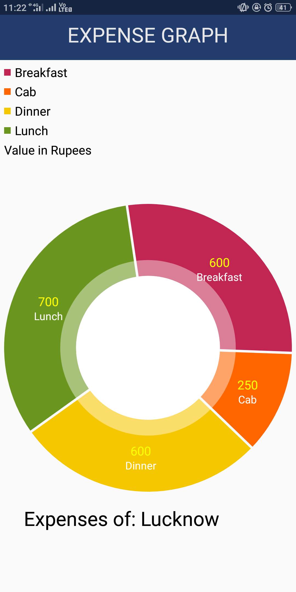
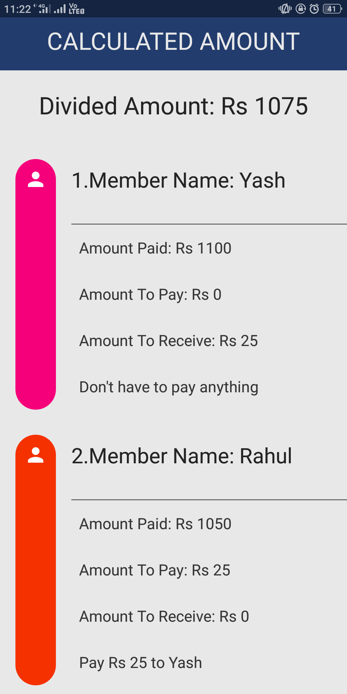
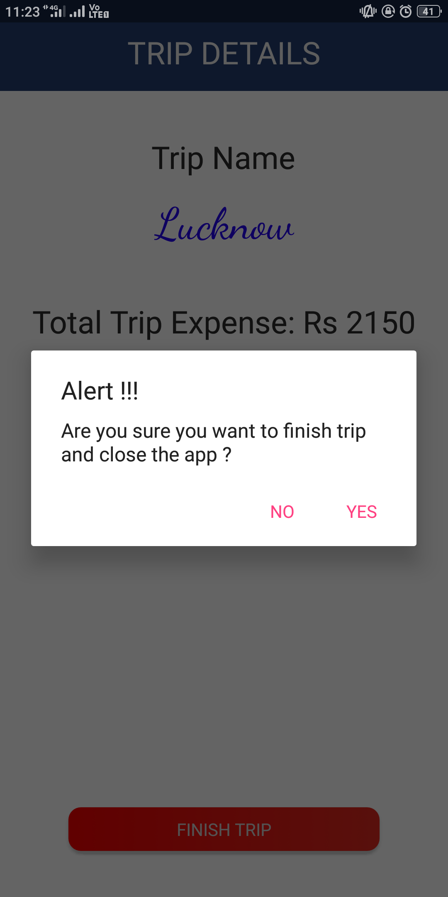

# Group Expense Tracker

This Expense Tracker application falls in the Finance Category and serves the important purpose of managing expenses while on trip with friends and colleagues. This application allows multiple users to maintain a digital automated diary. Application allows user to add trip to calculate all the expenses done by each member in the group. Group Expense Tracker application will keep a track of Income-Expense of a user on a day to day basis. This application takes all the expenses from multiple users and divides the amount round sum amount between each. Expense tracking application will generate report as and when required to show the expense via graph. The application also specifies the name of group member to whom the amount is to be given equally.

# Modules
This application comprises of 5 modules: 
1.Add Trip 
2.Add Members 
3.Add/Modify Expense 
4.Expense Graph 
5.Calculate 

# App Info
<b>Version:</b> 1.0 
<b>Updated on:</b> Feb 2019 
<b>Size:</b> 2.5 MB 
<b>App permissions:</b> No special permission required 

# Libraries used
<b>'br.com.simplepass:loading-button-android:1.7.2'</b> 
<b>'com.github.PhilJay:MPAndroidChart:v3.1.0-alpha'</b> 
<b>'com.github.PhilJay:MPAndroidChart:v3.1.0-alpha'</b> 
<b>'com.diegodobelo.expandingview:expanding-view:0.9.4'</b> 
<b>'com.sdsmdg.tastytoast:tastytoast:0.1.0'</b> 
<b>'com.airbnb.android:lottie:2.2.0'</b> 

Following are some of the screenshots of the app... 
 

